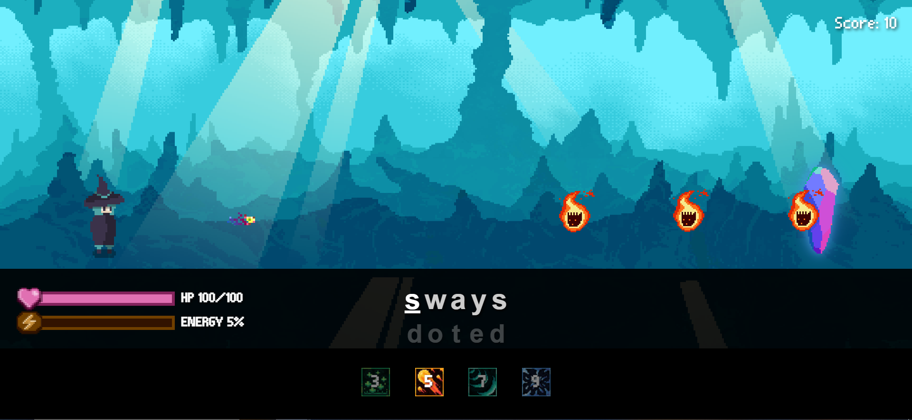

# The Cavern of Keystone



A single-player typing-based shooting game made with Cursor, built with React, TypeScript, and CSS. Defend your tower by typing words to unleash powerful skills against incoming enemies!


## 🎮 Features

### **Core Gameplay**
- **Typing-based Combat**: Type words to activate skills and defeat enemies
- **Four Unique Skills**:
  - **Heal** (3 letters): Restore health
  - **Bullet** (5 letters): Shoot projectiles at enemies
  - **Wind** (7 letters): Wind attack with knockback effects
  - **Impact** (9 letters): Area-of-effect attack with slowing fire effects
- **Ultimate Skill**: Build up energy to unleash a powerful screen-clearing electric attack!

### **Enemy Types**
- **Wisp** (mob, medium speed)
- **Bat** (mob, fast speed)
- **Ghost** (tank, strong and slow)
- **Eyeball** (fast mob that can attack repeatedly)
- **Undead Boss** (final boss with rapid attacks)

### **Game Systems**
- **Wave-based Progression**: 6 unique waves plus infinite mode
- **Difficulty Levels**: Easy (20 WPM), Normal (40 WPM), Hard (60 WPM)
- **Infinite Mode**: Endless waves for high-score chasing
- **Health & Energy Systems**: Manage health and energy for ultimate attacks
- **Score & WPM Tracking**: Track your typing performance and word count
- **Visual Effects**: Impact effects, fire effects, wind effects, and more!

### **Audio & Visual**
- **Pixel Art Sprites**: Hand-crafted pixel art animations
- **Sound Effects**: Audio feedback for all actions (bullets, impacts, healing, etc.)
- **Background Music**: Dynamic music that changes with game state
- **Visual Effects**: Screen-shaking impacts, floating damage numbers, death animations

## 🎯 How to Play

1. **Choose Difficulty**: Select Easy, Normal, or Hard mode
2. **Choose Game Mode**: Standard game or Infinite mode
3. **Type to Attack**: Type the words that appear to activate skills
4. **Manage Resources**: Watch your health and energy bars
5. **Defeat the Boss**: Survive 10 waves to face the Undead Boss
6. **Aim for High Scores**: Try to achieve the highest WPM and score possible!

## 🚀 Installation & Running

1. **Install dependencies**:
   ```bash
   npm install
   ```

2. **Start development server**:
   ```bash
   npm run dev
   ```

3. **Open your browser** and navigate to localhost from the link in your terminal

(Optional) **Build for production**:
   ```bash
   npm run build
   ```

## 📁 Project Structure

```
src/
├── components/              # React components
│   ├── StartScreen.tsx      # Game start screen with difficulty selection
│   ├── GameScreen.tsx       # Main game interface
│   ├── GameOverScreen.tsx   # Game over screen
│   ├── WinScreen.tsx        # Victory screen
│   ├── Player.tsx           # Player character with idle animation
│   ├── Enemy.tsx            # Enemy sprites and animations
│   ├── Bullet.tsx           # Bullet projectiles
│   ├── WordDisplay.tsx      # Word typing interface
│   ├── SkillBar.tsx         # Skill indicators
│   ├── DamageEffect.tsx     # Floating damage numbers
│   ├── PlayerDeathAnimation.tsx  # Player death sequence
│   ├── UndeadDeathAnimation.tsx  # Boss death sequence
│   ├── FireEffect.tsx       # Fire visual effects
│   ├── Impact.tsx           # Impact visual effects
│   ├── Wind.tsx             # Wind visual effects
│   ├── UltimateVfx.tsx      # Ultimate skill effects
│   ├── StrikeEffect.tsx     # Boss strike visual effects
│   ├── Crystal.tsx          # Enemy spawn crystal (The Keystone!)
│   ├── HintDisplay.tsx      # Hints for the tutorial
│   ├── WaveDisplay.tsx      # Wave progress indicator
│   └── WaveAnnouncement.tsx # Wave transition announcements
|
├── config/                  # Game configuration
│   ├── gameConfig.ts        # Core game settings and player/enemy stats
│   ├── skillConfig.ts       # Skill definitions 
│   ├── waveConfig.ts        # Wave configurations for enemy spawns
│   └── difficultyConfig.ts  # Difficulty multipliers 
├── hooks/                   # Custom React hooks
│   └── useGameLoop.ts       # 60 FPS game loop
├── reducers/                # State management
│   └── gameReducer.ts       # Game state reducer with all actions
├── utils/                   # Utility functions
│   ├── gameLogic.ts         # Core game mechanics and collision detection
│   ├── gameUtils.ts         # Helper functions and calculations
│   ├── audioManager.ts      # Audio playback management
│   ├── skillWordLoader.ts   # Word list loading for skills
│   └── waveSpawner.ts       # Enemy spawning and wave management
├── types.ts                 # TypeScript type definitions
├── index.css                # Global styles and animations
├── App.tsx                  # Main application component
└── main.tsx                 # Application entry point
```

## 🎨 Assets

The game uses carefully curated pixel art assets:

- **`public/assets/sprites/`** - Character spritesheets and animations
- **`public/assets/images/`** - UI elements and backgrounds  
- **`public/assets/vfx/`** - Visual effects (fire, impact, wind, ultimate, strike)
- **`public/assets/bullet/`** - Bullet animations
- **`public/assets/sfx/`** - Sound effects and background music
- **`public/assets/`** - Font files for UI typography
- **Word Lists**: `words.txt`, `words3.txt`, `words7.txt`, `words9.txt`

## 🛠️ Technical Details

- **Framework**: React 18 with TypeScript
- **Build Tool**: Vite for fast development and building
- **State Management**: useReducer for complex game state
- **Animation**: CSS-based sprite animations with requestAnimationFrame
- **Audio**: Web Audio API integration
- **Performance**: Optimized 60 FPS game loop
- **Code Quality**: TypeScript for type safety and better development experience


## 🎨 Credits

### Fonts
- **DungeonFont** by vrtxrry
- **Abbadon** by Nathan Scott

### Sprites
- **Blue Witch** by [Artist name]
- **Wisp** by ramenphysics22
- **Cave Bat, Ghost** by Pop Shop Packs
- **Eyeball** by penusbmic
- **Undead executioner** by kronovi

### Image Assets
- **Cave background** by seetyaji
- **Heart, Energy UI elements** by pixel_iwart
- **Crystals** by frakassets
- **Pixel Art Skill Icon** by PixelExplosive

### Visual Effects
- **Wind, white Slash (undead boss)** by nyk_nck
- **Fire bullet** by xyezawr
- **Impact, ultimate explosion** by Will Tice
- **Blue fires (impact)** by devkidd

### Sound Effects
- **Background music** by haberchuck
- **Pixel combat SFX** by Helton Yan

---

**Enjoy typing and fighting for your life!** 🏰⚔️